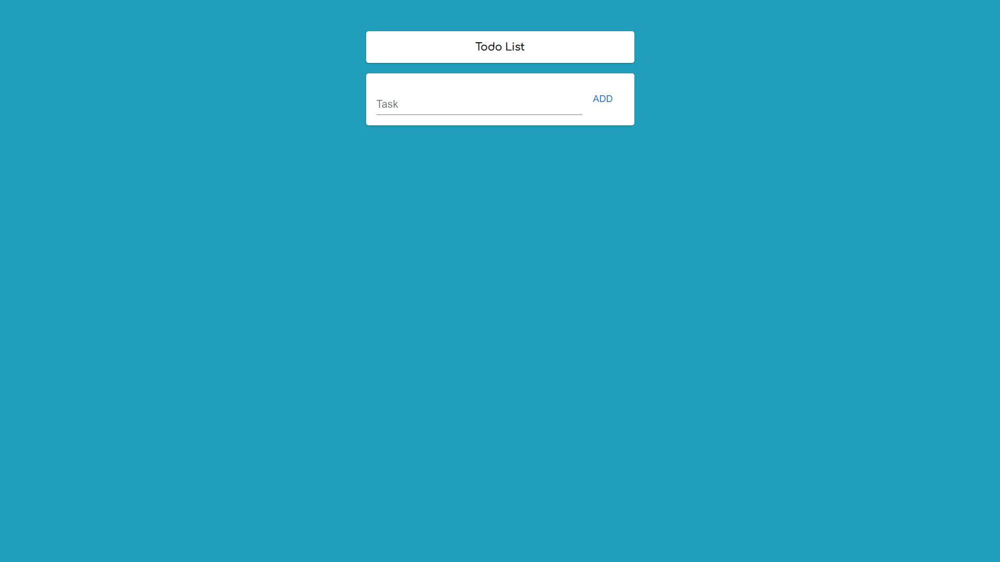
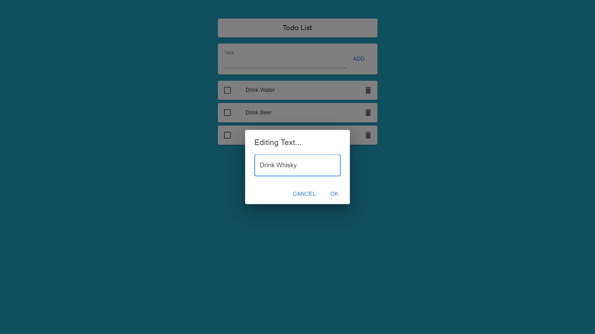
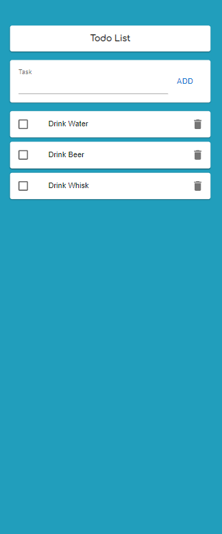

# <div align="center"> Todo List -  React App</div>


https://user-images.githubusercontent.com/102826996/183925202-8927c28a-4fd5-44b6-b5ab-1262687587eb.mp4


<h3>Desktop</h3>
<a href="http://todo-list-hudson3384.vercel.app/">
</a>

<h3>Editing</h3>
<a href="http://todo-list-hudson3384.vercel.app/">
</a>

<h3>Mobile</h3>
<a href="http://todo-list-hudson3384.vercel.app/">
</a>

<p align="center">A Responsive TodoList  made with React JS, Hooks, and using localstorage.</p>

## 🛠️ Technologies

<ul>
  <li><a href="https://reactjs.org/">React</a></li>
  <li><a href="https://mui.com/pt/">MUI Library</a></li>
</ul>

## ⚙️ Requirements

<ul>
  <li><a href="https://git-scm.com/">Git</a></li>
  <li><a href="https://nodejs.org/en/">Node.js</a></li>
  <li><a href="https://www.npmjs.com/">NPM</a></li>
  <li><a href="https://vitejs.dev/guide/">VITE</a></li>
</ul>

## 🚀 Installation

```
$ git clone https://github.com/Hudson3384/TodoList.git

```

## Author

 [<br><sub>Hudson Arruda Ribeiro</sub>](https://github.com/hudson3384)
